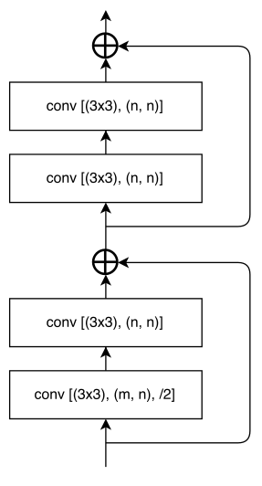
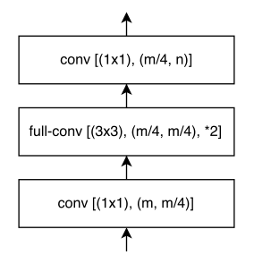

deep learning,segmentation,skin lesion,melanoma

Introduction
============

The purpose of this document is the description of the architecture used
in the 2018 ISIC Challenge for segmenting skin lesions present in
images. We use a deep learning based solution for solving the problem.
U-Net (Ronneberger, Fischer, and Brox 2015) derived architectures have
been proven to be a very solid approach for this purpose. LinkNet
(Chaurasia and Culurciello 2017) architecture allow the reduction of
required parameters for solving the same task. LinkNet use the same
approach that ResNets (He et al. 2016) for connecting encoder and
decoder filters. Instead of concatenating their values, they sum them
up, achieving state of the art results in semantic segmentation tasks.

Data and Preprocessing
======================

The train set is formed by 12,342 images with their corresponding masks.
A validation set with 1,436 images is used for hyper-parameter
optimization. Data augmentation techniques are used to increment the
diversity of input images and masks. Our data was extracted from the
"ISIC 2018: Skin Lesion Analysis Towards Melanoma Detection" grand
challenge datasets (Codella et al. 2017) (Tschandl, Rosendahl, and
Kittler 2018).

Model {#sec:class}
=====

We used a LinkNet derived network for solving this challenge reducing
the number of filters. Original ResNet architectures (ResNet18,
ResNet34, etc.) are designed to perfom well in large classification
problems like ImageNet(Deng et al. 2009). For the specific problem of
disease characterization, the diversity of images is smaller than in
such cases and enable the usage of narrower filter stacks, that's why we
limited the number of filters per layer to 64, allowing the usage of a
model of only 600,000 parameters

{#fig:linknet width="35%"}

Figure [1](#fig:linknet){reference-type="ref" reference="fig:linknet"}
shows a high level description of the model architecture. Network is
constituted by two parts: an encoder and a decoder. The encoder is a
residual net feature extractor. Decoder receives information from
different feature maps of the encoder, summing up such values with their
own. Figure
[\[fig:linknet\_enc\_dec\]](#fig:linknet_enc_dec){reference-type="ref"
reference="fig:linknet_enc_dec"} show a diagram with a high level
description of encoder and decoder blocks. Instead of concatenating
decoder and encoder values at the output of each layer, LinkNet uses a
residual network approach summing up the values, ie. reducing the number
of parameters of the final network.

{width="50%"}

 

{width="50%"}

Training procedure
==================

We split the training data in two sets: one with 13,000 images used for
training and another one with 1,400 images for validation. We use the
Adam optimizer with a learning rate of $10^-4$ and Dice coefficient as a
loss function. Model with higher performance in the validation set is
chosen as a final model.

References {#references .unnumbered}
==========

::: {#refs .references .hanging-indent}
::: {#ref-DBLP:journals/corr/ChaurasiaC17}
Chaurasia, Abhishek, and Eugenio Culurciello. 2017. "LinkNet: Exploiting
Encoder Representations for Efficient Semantic Segmentation." *CoRR*
abs/1707.03718. <http://arxiv.org/abs/1707.03718>.
:::

::: {#ref-DBLP:journals/corr/abs-1710-05006}
Codella, Noel C. F., David Gutman, M. Emre Celebi, Brian Helba, Michael
A. Marchetti, Stephen W. Dusza, Aadi Kalloo, et al. 2017. "Skin Lesion
Analysis Toward Melanoma Detection: A Challenge at the 2017
International Symposium on Biomedical Imaging (Isbi), Hosted by the
International Skin Imaging Collaboration (ISIC)." *CoRR* abs/1710.05006.
<http://arxiv.org/abs/1710.05006>.
:::

::: {#ref-imagenet_cvpr09}
Deng, J., W. Dong, R. Socher, L.-J. Li, K. Li, and L. Fei-Fei. 2009.
"ImageNet: A Large-Scale Hierarchical Image Database." In *CVPR09*.
:::

::: {#ref-he2016deep}
He, Kaiming, Xiangyu Zhang, Shaoqing Ren, and Jian Sun. 2016. "Deep
Residual Learning for Image Recognition." In *Proceedings of the Ieee
Conference on Computer Vision and Pattern Recognition*, 770--78.
:::

::: {#ref-ronneberger2015u}
Ronneberger, Olaf, Philipp Fischer, and Thomas Brox. 2015. "U-Net:
Convolutional Networks for Biomedical Image Segmentation." In
*International Conference on Medical Image Computing and
Computer-Assisted Intervention*, 234--41. Springer.
:::

::: {#ref-DBLP:journals/corr/abs-1803-10417}
Tschandl, Philipp, Cliff Rosendahl, and Harald Kittler. 2018. "The
HAM10000 Dataset: A Large Collection of Multi-Source Dermatoscopic
Images of Common Pigmented Skin Lesions." *CoRR* abs/1803.10417.
<http://arxiv.org/abs/1803.10417>.
:::
:::
